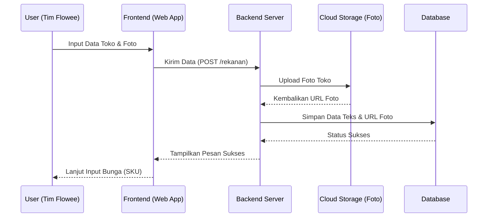
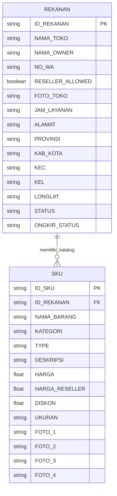

# PRD — Project Requirements Document

## 1. Overview
Saat ini, tim lapangan Flowee mencatat data toko bunga rekanan secara manual menggunakan kertas. Proses ini rentan terhadap kehilangan data, memakan waktu, dan tidak efisien untuk diolah kembali. 

**Aplikasi Flowee Survey** hadir sebagai solusi digital berbasis web/mobile bagi tim internal Flowee. Tujuannya adalah mempercepat dan mempermudah tim saat proses pendataan langsung di lapangan. Dengan keunggulan proses yang "lebih cepat", tim dapat langsung mengisi informasi pemilik toko, nomor WhatsApp, alamat lengkap, hingga mengunggah foto bunga serta mengecek harga jual langsung dari perangkat keras mereka. Harapannya, aplikasi ini memudahkan tim untuk terus memperluas jaringan dan mencari toko baru.

## 2. Requirements
- **Aksesibilitas Seluler (Mobile-Friendly):** Karena digunakan oleh tim di lapangan, antarmuka aplikasi harus dioptimalkan untuk layar ponsel pintar (smartphone).
- **Sistem Autentikasi Internal:** Hanya tim Flowee terdaftar yang dapat masuk dan mengakses form serta data survei.
- **Dukungan Media (Upload Gambar):** Aplikasi harus mampu memproses unggahan foto langsung dari kamera HP atau galeri (untuk foto toko dan produk bunga).
- **Proses Ringan & Cepat:** Navigasi pengisian formulir harus intuitif dan tidak lambat, menggantikan kebiasaan mencatat di kertas.

## 3. Core Features
- **Manajemen Data Toko (Rekanan):** Form pendaftaran toko yang mencakup Pengisian Nama Pemilik (sebagai capaian awal/first win), input nomor WhatsApp, alamat lengkap berjenjang (Provinsi hingga Kelurahan), koordinat lokasi, dan unggah foto fisik toko.
- **Katalog Produk Bunga (SKU):** Form untuk mendata produk spesifik dari setiap toko. Termasuk fitur pilih kategori bunga, input harga jual toko dan harga *reseller*, serta fasilitas unggah hingga 4 foto untuk tiap jenis bunga.
- **Daftar & Penelusuran Toko:** Dasbor untuk melihat daftar toko yang sudah disurvei. Memudahkan tim untuk melacak progres atau memutuskan untuk mencari toko baru.

## 4. User Flow
1. **Login:** Anggota tim Flowee masuk menggunakan akun internal.
2. **Dasbor Utama:** Pengguna melihat daftar toko yang sudah didata atau menekan tombol "Tambah Toko Baru".
3. **Mengisi Data Rekanan:** 
   - Pengguna mulai dengan mengisi **Nama Pemilik** dan **Nama Toko**.
   - Melengkapi **Nomor WA**.
   - Menulis alamat lengkap dan detail wilayah.
   - Mengunggah foto fisik toko.
   - Menyimpan data toko.
4. **Mendata Produk (SKU):** Setelah toko tersimpan, pengguna memilih toko tersebut dan menekan "Tambah Bunga/Produk".
   - Pengguna memilih **Kategori Bunga**.
   - Mengecek/mengisi harga jual dan harga reseller.
   - Mengunggah foto bunga (maksimal 4 foto).
   - Menyimpan data produk.
5. **Selesai:** Pengguna kembali ke Dasbor untuk meninjau data atau bersiap **Mencari toko baru** lainnya.

## 5. Architecture
Sistem dibangun menggunakan pendekatan arsitektur aplikasi web modern (Client-Server). Bagian *Frontend* menangani antarmuka di HP tim lapangan, mengirimkan data melalui *API* ke *Backend*, yang kemudian mengunggah foto ke *Cloud Storage* dan menyimpan data teks ke *Database*.

## 6. Database Schema
Aplikasi ini berpusat pada dua entitas utama: **Rekanan** (Toko Bunga) dan **SKU** (Produk Bunga). Satu Rekanan dapat memiliki banyak SKU.

### Diagram Relasi Entitas (ER Diagram)

### Penjelasan Tabel:
1. **Tabel REKANAN**
   - Mengelola informasi fisik dan administratif toko bunga.
   - Kolom kunci: `ID_REKANAN` (ID unik), `NAMA_TOKO`, `NAMA_OWNER` (Nama pemilik), `NO_WA` (Kontak), `FOTO_TOKO` (URL gambar), `ALAMAT` beserta wilayah (Provinsi, Kota, dll.), dan `LONGLAT` (Titik lokasi Google Maps).
2. **Tabel SKU**
   - Mengelola daftar produk atau bunga yang dijual di toko rekanan tersebut.
   - Kolom kunci: `ID_SKU` (ID unik produk), `ID_REKANAN` (Relasi ke toko penjual), `KATEGORI` (Jenis bunga), `HARGA` (Harga jual pelanggan umum), `HARGA_RESELLER` (Harga untuk Flowee), dan slot foto `FOTO_1` hingga `FOTO_4` (URL gambar produk).

## 7. Tech Stack
Berikut adalah rekomendasi teknologi untuk membangun aplikasi yang cepat, ringan, dan modern sesuai standar industri saat ini:

- **Frontend:** Next.js (Memberikan performa tinggi untuk akses web di HP), Tailwind CSS (Untuk styling yang cepat dan rapi), shadcn/ui (Komponen antarmuka siap pakai).
- **Backend:** Next.js App Router (Server Actions / API Routes untuk menangani logika bisnis).
- **Autentikasi:** Better Auth (Sistem login ringan yang aman untuk tim internal).
- **Database Utama:** SQLite (Database ringan dan sangat cepat, ideal untuk skala pendataan awal).
- **ORM:** Drizzle ORM (Menghubungkan Backend ke SQLite dengan cara yang aman dan efisien).
- **Cloud Storage (Penyimpanan Foto):** Cloudinary atau AWS S3 (Untuk menampung dan menyajikan unggahan gambar toko dan bunga secara independen agar tidak membebani database utama).
- **Deployment:** Vercel (Platform hosting otomatis dan andal untuk Next.js).